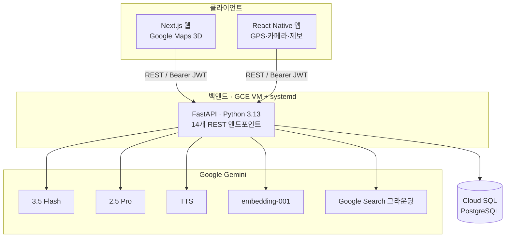

<!-- 이 파일은 발표(PPT) 콘텐츠입니다. `---`로 슬라이드가 구분되며 Marp/Slidev로 바로 변환하거나
     각 섹션을 PowerPoint 슬라이드에 복붙할 수 있습니다. `>` 블록은 발표자 멘트(스피커 노트)입니다. -->

# EquiScope 🗺️
### 지표를 넘어 삶으로 — *Beyond Metrics to Lived Realities*

**다차원 불평등 공간 시각화 & AI 정책 시뮬레이터**

Team EquiScope · 2026 해커톤

> 한 줄 소개: "지니계수라는 숫자를 넘어, 불평등이 **우리 동네 지도 위 삶**으로 보이게 하고, AI로 정책을 미리 실험하는 플랫폼"

---

## 1. 문제 정의 (Problem)

**불평등은 심각한데, 우리는 그것을 '숫자'로만 본다.**

- 📉 **추상적 지표의 한계** — 지니계수·소득분위 같은 숫자는 체감이 안 된다. "그래서 우리 동네는, 내 이웃은?"에 답하지 못한다.
- 🧩 **흩어진 데이터** — 소득·의료·교육·환경 불평등 데이터가 따로 놀고, 지도 위 '삶의 맥락'으로 연결되지 않는다.
- 🔮 **정책의 깜깜이** — 새 복지·세금 정책이 실제 서민 개개인에게 어떤 영향을 줄지 **미리 시뮬레이션할 방법이 없다.**
- 🙉 **목소리 없는 취약계층** — 교통약자·고령·저소득층은 자신의 불평등을 알리고 정책에 반영시킬 통로가 없다.

> 핵심: 불평등은 '측정'은 되지만 '체감·예측·행동'으로 이어지지 않는다.

---

## 2. 솔루션 개요 (Solution)

**EquiScope = 지도로 보고 · AI로 실험하고 · 시민이 참여하는 불평등 플랫폼**

1. 🗺️ **본다** — 소득·의료·기후·교육 불평등을 **전국 지도 위 3D 격자**로 시각화
2. 🧪 **실험한다** — 정책을 만들면 **1,000명 가상 시민**에게 돌려 지니계수 변화 + 개인별 삶의 이야기를 생성
3. 💬 **조언받는다** — 실제 정책 문서를 근거로 **AI가 사각지대를 진단**하고 상담
4. 📸 **참여한다** — 시민이 현장 불평등을 사진·음성으로 제보 → 지도에 즉시 반영

> "숫자 → 지도 → 시뮬레이션 → 행동"의 완결된 루프.

---

## 3. 핵심 기능 (Core Features) ①

| # | 기능 | 무엇을 하나 |
|---|---|---|
| **F-1** | 다차원 불평등 지도 | 전국 **250개 시군구** 실데이터로 소득·의료·기후·교육 격차를 3D 격자 시각화 |
| **F-2** | 실시간 이슈 탐지 | Gemini + **구글 검색**으로 지금 이 지역의 실제 불평등 뉴스를 지도 핀으로 |
| **F-3** | 페르소나 시뮬레이터 | 정책을 **1,000 가상 시민**에 적용 → 지니계수 전/후 + AI가 쓴 감정 일기 |
| **F-4** | 위성 빈곤지수(SPI) | 좌표 기반 물리적 주거·인프라 취약성 리포트 |

---

## 3. 핵심 기능 (Core Features) ②

| # | 기능 | 무엇을 하나 |
|---|---|---|
| **F-5** | AI 정책 어드바이저 | **벡터 검색 RAG**로 실제 정책 근거를 인용한 전문가 상담 |
| **F-6** | 데이터 소니피케이션 | 페르소나 일기를 **실제 음성(TTS)**으로 — 시각약자 접근성 |
| **F-7** | 법안 사각지대 감사 | 정책안의 허점·소외 계층·개정안을 RAG로 자동 진단 |
| **F-8** | AI 행정 신문고 *(로드맵)* | 제보 → 법령 인용 민원서 자동 작성으로 '행동'까지 |

> 강조: **F-1·F-3·F-5는 진짜 실데이터·실 AI로 지금 작동**합니다 (데모 가능).

---

## 4. 기술 아키텍처 (Architecture)

- **백엔드**: FastAPI, JWT 인증, `/media` 파일 서빙 · **배포**: GCE VM `34.67.12.246:8080` (systemd 상시 구동)
- **DB**: Cloud SQL PostgreSQL (서울 리전) · **RAG**: gemini-embedding-001(3072차원) 코사인 벡터 검색

---

## 5. 데이터 출처 & 신뢰성 (Data)

**"가짜 숫자로 지도를 채우지 않았다."** — 실데이터/합성을 정직하게 구분.

| 데이터 | 성격 | 출처 |
|---|---|---|
| 전국 250개 시군구 좌표 | 🟢 실데이터 | 공개 행정경계 GeoJSON (KOSTAT 2018) |
| 지역 소득·의료·환경·교육 통계 | 🟢 실수집 | Gemini + **구글 검색 그라운딩** (공개 웹 통계) |
| 정책 코퍼스 16건 + 임베딩 | 🟢 실데이터 | 실제 한국 공개 정책 + gemini-embedding-001 |
| 지니계수·격차 산출 | 🧮 실계산 | 표준 수식 |
| 1,000 페르소나 | 🧪 합성(표기) | 인구통계 시뮬레이션 모델 |

> 차별점: 모든 데이터의 출처·성격을 `DATA.md`에 문서화 — 심사에서 **신뢰성**으로 어필.

---

## 6. 우리가 다른 점 (Differentiators)

- ✅ **진짜 벡터 RAG** — 키워드 매칭이 아니라 임베딩 의미 검색. *"폭염에 에어컨 없는 노인"* → 단어 안 겹쳐도 **에너지바우처** 정책을 찾아냄.
- ✅ **실시간 그라운딩** — 하드코딩 뉴스가 아니라 **지금 웹의 실제 불평등 뉴스**를 검색해 매핑.
- ✅ **전국 실좌표 데이터** — 좌표 해시로 만든 가짜가 아닌, 공개 행정경계 기반 250개 시군구.
- ✅ **라이브 배포** — 목업이 아니라 **실제 클라우드에 떠 있고 팀이 지금 붙는** 14개 API.
- ✅ **접근성 내장** — TTS 소니피케이션으로 시각약자까지 포용.

---

## 7. 데모 시나리오 (Live Demo)

1. 🗺️ 지도에서 **우리 동네 의료 불평등** 확인 → 격자가 붉게(취약) 솟아오름
2. 📰 그 위에 **실시간 뉴스 핀** — "응급실 야간 전문의 확보 실패"
3. 🧪 "청년 교통비 월 5만원 지원" 정책 입력 → **지니계수 0.514 → 0.502**, 21세 배달노동자의 **AI 일기** 출력
4. 🔊 그 일기를 **음성으로 재생**
5. 💬 AI 어드바이저에 "이 정책 사각지대는?" → **실제 법령 인용** 답변
6. 📸 시민이 '경사로 파손' **제보** → 지도 격자 점수 즉시 하락

> 완결 루프를 90초 안에 보여준다.

---

## 8. 기술적 도전 & 해결 (Challenges)

- 🧩 **LLM JSON 깨짐** — Gemini가 닫는 괄호를 빠뜨린 채 응답 → 관대한 파서(펜스 제거·괄호 자동 보정)로 폴백률 대폭 감소.
- 🌏 **전국 실좌표** — LLM 좌표는 부정확 → 공개 GeoJSON 경계에서 **중심좌표 직접 계산**.
- ⚡ **지도 속도 vs 실데이터** — 타일마다 LLM 호출은 느림 → 통계를 **1회 수집해 DB 캐싱**, 조회는 즉시.
- ☁️ **실 클라우드 배포** — Python 3.13 wheel 이슈, Cloud SQL 연결, systemd 상시 구동까지 실제 운영.

> "해커톤이지만 목업이 아니라 **실제로 돌아가게** 만들었다."

---

## 9. 임팩트 & 확장 로드맵 (Impact & Roadmap)

**임팩트**
- 시민: 내 지역 불평등을 '체감'하고 직접 '제보'
- 정책결정자: 정책을 시민 단위로 '미리 실험'
- 취약계층: 접근성(TTS)과 목소리(제보) 확보

**로드맵**
- 📄 **F-8 AI 행정 신문고** — 제보 → 실제 민원서 자동 작성
- 📊 **KOSIS 공식 데이터** 연동으로 정밀도 강화
- 🌐 지역 → **전국 → 글로벌** 불평등 비교
- 🤖 **RAG 기반 시뮬레이션**으로 정책 근거 강화

---

## 10. 팀 & 역할 (Team)

| 역할 | 담당 |
|---|---|
| 🛠️ **백엔드 / GCP / AI** | 인프라·DB·Gemini 오케스트레이션·14개 API·RAG·배포 |
| 🎨 **프론트엔드 (Next.js)** | 3D 지도 시각화·시뮬레이터 대시보드·AI 상담 UI |
| 📱 **앱 (React Native)** | GPS 위치 알림·카메라/음성 제보·모바일 접근성 |

> 백엔드가 실데이터·AI 허브를 제공 → 프론트·앱은 UX에 집중하는 구조.

---

## EquiScope 🗺️
### 지표를 넘어, 삶으로.

**불평등을 보이게. 정책을 실험하게. 시민을 참여하게.**

- 🌐 라이브 데모: `http://34.67.12.246:8080/docs`
- 📚 문서: `API.md` · `DATA.md`

**감사합니다** 🙏
